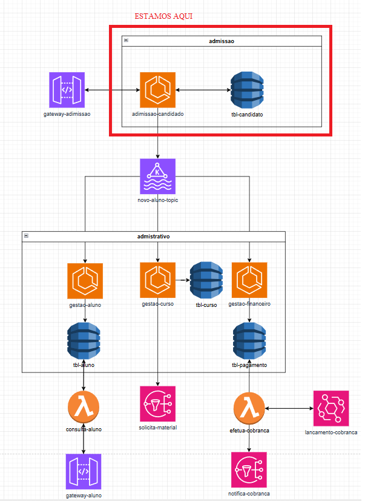

# 📘 hub-colegio-admissao-aluno

Projeto desenvolvido com arquitetura **hexagonal**, utilizando **Spring Boot**, **Apache Kafka**, **Avro**, **MongoDB**, e **DynamoDB** para lidar com o fluxo de cadastro e publicação de alunos em um hub de integração escolar.

## 🌐 Visão de Sistemas Distribuídos

Abaixo, temos uma representação visual do ecossistema da aplicação, com foco em mensageria, persistência e integração entre os módulos:



---

## 🚀 Objetivo

Gerenciar e publicar informações de candidatos (alunos) em um pipeline de integração escolar, garantindo persistência, envio para tópicos Kafka e conformidade com esquemas Avro.

---

## 🧱 Arquitetura

Este projeto segue o padrão **Ports & Adapters (Arquitetura Hexagonal)**, promovendo separação entre regras de negócio, comunicação externa e infraestrutura.

🔎 Veja detalhes em [`docs/arquitetura.md`](docs/arquitetura.md)

---

## 📦 Tecnologias utilizadas

- Java 17
- Spring Boot 3
- Apache Kafka + Avro (Schema Registry)
- MongoDB (Spring Data)
- DynamoDB (via spring-data-dynamodb)
- Maven
- Docker / Docker Compose

---

## 📡 Integração Kafka

Publicações no tópico Kafka com eventos tipados Avro.

🔎 Veja o schema Avro e detalhes de uso em [`docs/eventos-kafka.md`](docs/eventos-kafka.md)

---

## 📨 Endpoints da API

A API expõe endpoints REST para cadastro de candidatos.

🔎 Veja detalhes em [`docs/endpoints.md`](docs/endpoints.md)

---

## ⚙️ Configurações

Todas as configurações (Kafka, Mongo, Dynamo, etc) estão centralizadas no `application.yml`.

🔎 Veja detalhes em [`docs/configuracoes.yml.md`](docs/configuracoes.yml.md)

---

## 🧬 Estrutura de Pacotes

Organização baseada em responsabilidades (domain, application, infra...).

🔎 Veja o detalhamento em [`docs/estrutura-pacotes.md`](docs/estrutura-pacotes.md)

---

## 🛠️ Como executar localmente

```bash
# Subir serviços dependentes (Kafka, Mongo etc) se aplicável
docker-compose up -d

# Executar aplicação
./mvnw spring-boot:run
```

---

## 🤝 Contribuições

Sinta-se à vontade para abrir issues, PRs e sugerir melhorias!

---

## 👨‍💻 Autor

Desenvolvido por Jessé com 💡 foco em escalabilidade, integração e arquitetura limpa.
